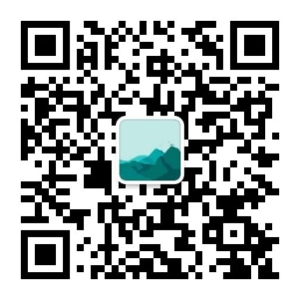

# nof1.ai Alpha Arena AI大模型交易监控系统

监控[AI trading in real markets](https://nof1.ai/) Alpha Arena AI大模型加密货币交易行为的通知系统，当检测到交易变化时会通过企业微信群机器人发送通知。

[](https://opensource.org/licenses/MIT)
[](https://www.python.org/downloads/)
[](https://github.com/psf/black)

## ⚠️ 免责声明

**本项目仅供学习和研究使用，不构成投资建议。**

- 加密货币交易存在高风险，可能导致资金损失
- 使用本系统进行交易决策的风险由用户自行承担
- 作者不对任何交易损失负责
- 请在使用前充分了解相关风险

## 功能特性

- 🔄 **定时监控**: 每分钟自动获取Alpha Arena持仓数据
- 📊 **变化检测**: 智能分析持仓变化，识别交易行为
- 📱 **实时通知**: 通过企业微信群机器人发送交易提醒
- 🎯 **精准监控**: 支持指定特定模型进行监控
- 📝 **详细日志**: 完整的操作日志记录
- ⚙️ **灵活配置**: 通过环境变量进行配置管理

## 系统架构

```
AI交易监控系统
├── position_fetcher.py    # 持仓数据获取模块
├── trade_analyzer.py      # 交易分析模块
├── wechat_notifier.py     # 企业微信通知模块
├── trading_monitor.py     # 定时任务调度模块
├── main.py               # 主程序入口
├── requirements.txt      # 依赖包列表
└── config.env.example    # 配置文件示例
```

## 安装和配置

### 1. 安装依赖

```bash
# 激活虚拟环境
source venv/bin/activate

# 安装依赖包
pip install -r requirements.txt
```

### 2. 配置环境变量

复制配置文件模板：
```bash
cp env.example .env
```

编辑 `.env` 文件，配置以下参数：

```env
# 企业微信机器人webhook地址（必需）
WECHAT_WEBHOOK_URL=https://qyapi.weixin.qq.com/cgi-bin/webhook/send?key=YOUR_WEBHOOK_KEY

# 通知类型（目前只支持wechat）
NOTIFICATION_TYPE=wechat

# 关注的模型列表，多个用逗号分隔，为空则监控所有模型
# 例如：deepseek-chat-v3.1,claude-sonnet-4-5
MONITORED_MODELS=

# API接口地址
API_URL=https://nof1.ai/api/account-totals

# 日志级别
LOG_LEVEL=INFO
```

### 3. 获取企业微信机器人Webhook

1. 在企业微信群中添加机器人
2. 获取机器人的Webhook URL
3. 将URL配置到 `WECHAT_WEBHOOK_URL` 中

## 使用方法

### 启动监控系统

```bash
# 激活虚拟环境
source venv/bin/activate

# 启动监控系统
python main.py
```

### 测试通知功能

```bash
# 测试企业微信通知是否正常
python main.py --test
```

### 其他选项

```bash
# 设置日志级别
python main.py --log-level DEBUG

# 指定配置文件
python main.py --config /path/to/.env
```

## 监控逻辑

1. **数据获取**: 每分钟从API获取当前持仓数据
2. **数据保存**: 将当前数据保存为 `current.json`
3. **变化检测**: 与上次数据 `last.json` 进行比较
4. **交易分析**: 识别以下交易行为：
   - 新开仓（买入/卖出）
   - 平仓
   - 加仓/减仓
   - 杠杆调整
   - 模型新增/删除
5. **通知发送**: 如有变化，发送企业微信通知
6. **数据更新**: 将 `current.json` 重命名为 `last.json`

## 通知格式

系统会发送格式化的Markdown消息，包含：

- 🚨 交易提醒标题
- ⏰ 检测时间
- 📊 变化数量统计
- 🤖 按模型分组的交易详情
- 📈📉 交易类型图标

## 日志文件

系统会在 `logs/` 目录下生成日志文件：
- `trading_monitor.log`: 主要操作日志

## 注意事项

1. **首次运行**: 第一次运行时会跳过比较，因为不存在历史数据
2. **网络连接**: 确保服务器能够访问API和企业微信接口
3. **权限配置**: 确保企业微信机器人有发送消息的权限
4. **数据安全**: 持仓数据会保存在本地JSON文件中，请注意数据安全

## 故障排除

### 常见问题

1. **通知发送失败**
   - 检查企业微信Webhook URL是否正确
   - 确认机器人没有被移除或禁用

2. **API获取失败**
   - 检查网络连接
   - 确认API地址是否正确

3. **配置文件错误**
   - 检查 `.env` 文件格式
   - 确认所有必需参数都已配置

### 调试模式

使用DEBUG日志级别获取更详细的调试信息：

```bash
python main.py --log-level DEBUG
```

## 系统要求

- Python 3.7+
- 网络连接
- 企业微信群机器人权限

## 许可证

本项目采用MIT许可证 - 查看 [LICENSE](LICENSE) 文件了解详情。

## 贡献

欢迎贡献代码！请查看 [CONTRIBUTING.md](CONTRIBUTING.md) 了解如何参与项目开发。

## 安全

如果您发现了安全漏洞，请查看 [SECURITY.md](SECURITY.md) 了解如何报告。

## 联系方式

如有问题或建议，请通过以下方式联系：

- 创建 [GitHub Issue](https://github.com/okay456okay/nof1.ai.monitor/issues)
- X (Twitter): [@okay456okay](https://x.com/okay456okay)
- 微信公众号：远见拾贝
- 网站: [远见拾贝 - 用远见洞察，赚确定性的钱](https://www.insightpearl.com/)



---

**再次提醒：本项目仅供学习和研究使用，不构成投资建议。加密货币交易存在高风险，请谨慎使用。**
